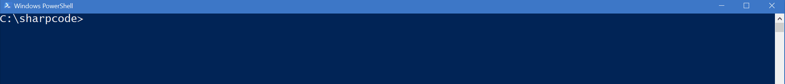

# posh-azure

A project intended to make working with the Azure PowerShell cmdlets a little more fun and productive.

Currently the project adds completion for parameters (e.g. ResourceGroupName, Location)



I plan to keep working on this to improve completion, but if there are parameters that aren't completing (or completing incorrectly) then raise an issue :-)

## Dependencies

### PowerShell

I've tested this on PowerShell 5.1 on Windows. In _theory_ I believe it should work on PowerShell 3 upwards - let me know if you test that!

* [Azure PowerShell cmdlets](https://docs.microsoft.com/en-us/powershell/azure/install-azurerm-ps?view=azurermps-4.2.0)

### PowerShell Core

I've also tested this with PowerShell Core

## Installation

After intalling the pre-requisites above, install [posh-azure](https://www.powershellgallery.com/packages/posh-azure) via PowerShell gallery

```powershell
 Install-Module -Name posh-azure
```

Once the module is installed, you can load it with:

```powershell
 Import-Module -Name posh-azure
```

**NOTE: You must ensure that you are logged in to Azure with the cmdlets to get completion**

To have posh-azure always loaded, add the `Import-Module` to your `$PROFILE`

## Release notes

## 0.3.7 (published 2018-04-05)

Handle null outputs (e.g. on cancelled deployment)

## 0.3.6 (published 2018-04-05)

Use UTC dates to avoid timezone issues

## 0.3.5 (published 2018-02-26)

Handle `Accepted` deployment state and continue refreshing rather than exiting

## 0.3.4 (published 2018-02-25)

Show deployment outpus once deployment completes

## 0.3.3 (published 2017-11-16)

Fix: show friendly message when no deployments are found

## 0.3.2 (published 2017-11-13)

Update duration parsing to handle negative durations (yes - I have seen these!)

## 0.3.1 (published 2017-10-05)

Fix colourisation of Show-AzureRmResourceGroupDeploymentProgress output on linux/bash

## 0.3.0 (published 2017-10-05)

Add completion for

* VM Names
* Update to enable working without TabExpansionPlusPlus installed (which helps with PowerShellCore!)

Add Show-AzureRmResourceGroupDeploymentProgress cmdlet to show auto-updating progress on ARM deployments

## 0.2.0 (published 2017-08-31)

Add completion for 

* AppServicePlan name
* StorageAccount name

Revise commands that ResourceGroupName completion is applied to

## 0.1.1 (published 2017-07-21)

Add completion for

* WebApp names

## 0.1.0 First version (published 2017-07-15)

Completion for 

* ResourceGroupName parameters
* Location parameters
* DeploymentName parameters